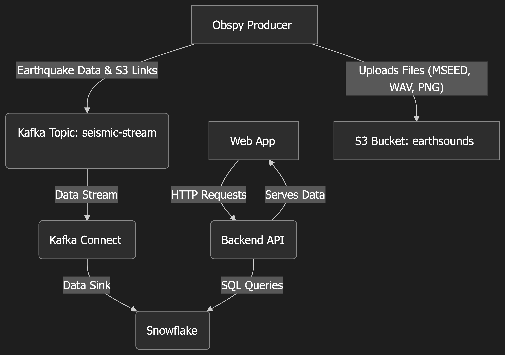
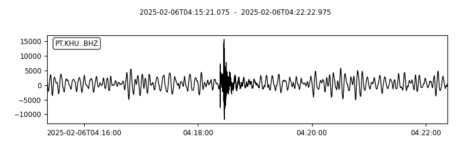
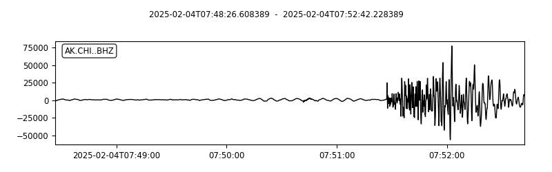
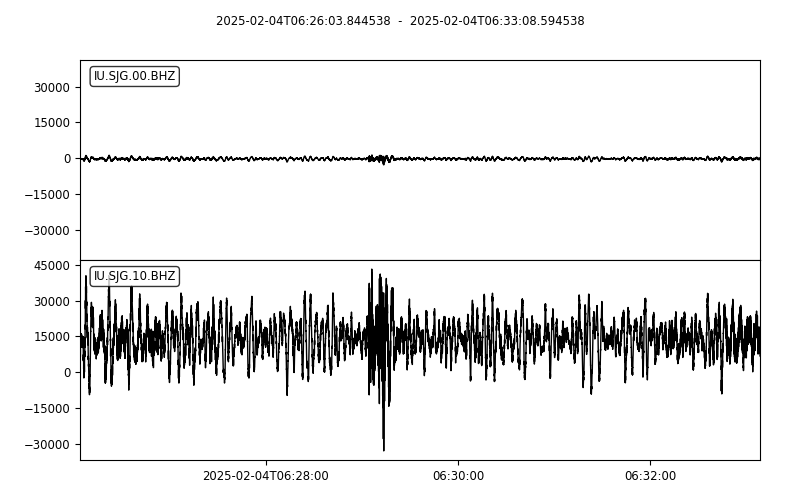

# Earthquake Sounds


## Overview

Earthquake Sounds is a comprehensive system designed to monitor global seismic activity in real-time. It captures earthquake data using `obspy`, processes it, and streams this information through a modern data pipeline involving Kafka, AWS S3, and Snowflake. The ultimate goal is to provide timely and engaging earthquake reports, including visual and audio representations, via a web interface. This project allows you to experience and "hear" earthquakes as they happen around the world.

## Features

-   **Real-time Seismic Data Ingestion:** Utilizes `obspy` to fetch live earthquake data from global monitoring sources.
-   **Data Processing & Enrichment:** Converts seismic signals into various formats (MSEED, WAV, PNG).
-   **Scalable Data Streaming:** Employs Kafka for robust, real-time streaming of earthquake metadata.
-   **Cloud Storage for Artifacts:** Leverages AWS S3 for durable storage of generated waveform files (MSEED, WAV, PNG).
-   **Data Warehousing:** Uses Snowflake (via Kafka Connect) to store and manage structured earthquake data for analytics and querying.
-   **Web Application Interface:** A Flask-based web application serves as the front-end for visualizing earthquake reports and accessing data.
-   **Microservice Architecture:** Key components like the `obspy` producer run as distinct services, managed by Docker.
-   **Infrastructure as Code:** Utilizes Terraform for automating cloud infrastructure setup (e.g., for Snowflake deployment).
-   **Containerized Deployment:** Fully Dockerized for consistent and easy deployment across environments.

## Architecture

The system is composed of several interconnected microservices and cloud components:

1.  **Obspy Producer (`obspy` service):** Fetches raw seismic data, processes it into multiple formats (MSEED, WAV, PNG), uploads these files to AWS S3, and then publishes earthquake metadata (including S3 links) to a Kafka topic.
2.  **AWS S3:** Serves as the primary storage for all generated waveform files.
3.  **Kafka Cluster:** Acts as a message broker, with topics like `seismic-stream` for real-time earthquake metadata.
4.  **Kafka Connect (`kafka-connect` service):** Uses the Snowflake Sink Connector to transfer data from Kafka topics into Snowflake tables.
5.  **Snowflake:** The cloud data warehouse storing structured earthquake information for querying by the backend API.
6.  **Web Application (`web_app` service):** A Flask application that provides a backend API to query Snowflake and a frontend to display earthquake data and visualizations.
7.  **Supporting Services:** Zookeeper (for Kafka), Kafka UI (for topic management).



## Prerequisites

Ensure you have the following installed:
-   Python 3.11+ (primarily for local script execution if not using Docker)
-   Docker and Docker Compose
-   Terraform (for managing cloud infrastructure related to Snowflake, if applicable)
-   AWS Account and configured AWS CLI (if managing S3 or other AWS resources manually, though the application uses credentials via environment variables).

## Earthquake Monitoring

Refer to `obspy/README.md` for a more detailed description

## Getting Started

The recommended way to run the entire application stack is using Docker Compose.

### 1. Clone the Repository
```sh
git clone https://github.com/mypolopony/earthquake_sounds.git
cd earthquake_sounds
```

### 2. Environment Configuration
Create a `.env` file in the project root directory. This file will store your AWS credentials and S3 bucket information.
```env
# .env
S3_BUCKET_NAME=your-s3-bucket-name-here
AWS_ACCESS_KEY_ID=your_aws_access_key_id_here
AWS_SECRET_ACCESS_KEY=your_aws_secret_access_key_here
AWS_DEFAULT_REGION=your_aws_region_here # e.g., us-west-2
```
Replace the placeholder values with your actual S3 bucket name and AWS credentials. The `obspy` producer service will use these to upload files to S3.

### 3. Build and Run with Docker Compose
This command will build the images for all services (if they don't exist or if Dockerfiles have changed) and start them.
```sh
docker-compose up --build
```
This will launch:
-   `obspy` producer (fetching data, uploading to S3, sending to Kafka)
-   `zookeeper`
-   `kafka` broker
-   `kafka-connect` (for Snowflake sink, requires separate connector configuration)
-   `kafka-ui` (accessible at `http://localhost:8080`)
-   `web_app` (Flask application, accessible at `http://localhost:5001`)

### 4. Accessing Services
-   **Web Application:** Open your browser to `http://localhost:5001`
-   **Kafka UI:** Open your browser to `http://localhost:8080` to monitor Kafka topics (e.g., `seismic-stream`).

## Cloud Deployment (Terraform for Snowflake)

Terraform configurations are provided for setting up Snowflake resources.
-   **Kafka Integration:** For deploying Snowflake resources compatible with Kafka integration (e.g., users, roles, stages for the Kafka Connector), navigate to [`obspy/tf/kafka`](obspy/tf/kafka).
-   **Direct PUT Integration:** For an alternative Snowflake setup using HTTPS PUT for data ingestion, refer to the configurations in [`obspy/tf/direct_put`](obspy/tf/direct_put).

Follow the standard Terraform workflow (`init`, `plan`, `apply`) within these directories to manage your Snowflake infrastructure.

## Usage

Once the system is running via `docker-compose`:
-   The **Obspy Producer** automatically starts fetching earthquake data, processing it, uploading files (MSEED, WAV, PNG) to your configured S3 bucket, and sending metadata messages to the `seismic-stream` Kafka topic.
-   The **Kafka Connect** service (if configured with the Snowflake sink connector) will consume these messages and load the data into your Snowflake database.
-   The **Web Application** (`web_app` service) can then be used to view earthquake reports. Its backend API will query Snowflake for the latest data. (Note: The web application's functionality to display data from Snowflake would need to be fully implemented).
-   You can monitor the data flow using **Kafka UI**.

## Example Earthquakes

The `img/` directory contains some example waveform images and audio files from past events. As the system runs, new data will be stored in S3.

11932886_2.0
- 
- [11932886_2.0_wav](img/16.15_PT.KHU.wav)

11931570_4.0
- 
- [11931570_4.0_wav](img/94.78_AK.CHI.wav)

11931522_1.75
- 
- [11931522_1.75_wav](img/39.98_IU.SJG.wav)
